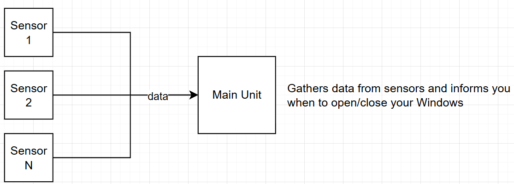

Back to project README: [KeepCoolTogether](../../README.md)

# KCTOutsideAir

A simple DIY system that informs you when to open your windows to get that nice, dry, clean air inside.

## Operating principal
Depending on the time of day, the outside air can be more refreshing than the inside air. This system measures temperature and humidity, and  informs you when to open and close your windows. You do not need an expensive/complex home automation system to keep cool.

## Overview
ESP32 development boards are used for both the Main Module and Sensor Modules. Sensor Modules periodically send temperature and humidity measurements to the Main module using [ESP-Now](https://www.espressif.com/en/solutions/low-power-solutions/esp-now). The Main Module evaluates the data and informs you when to open your windows, either via the onboard LED indicators, or optionally, via the Main Modules web interface (requires wifi network).

